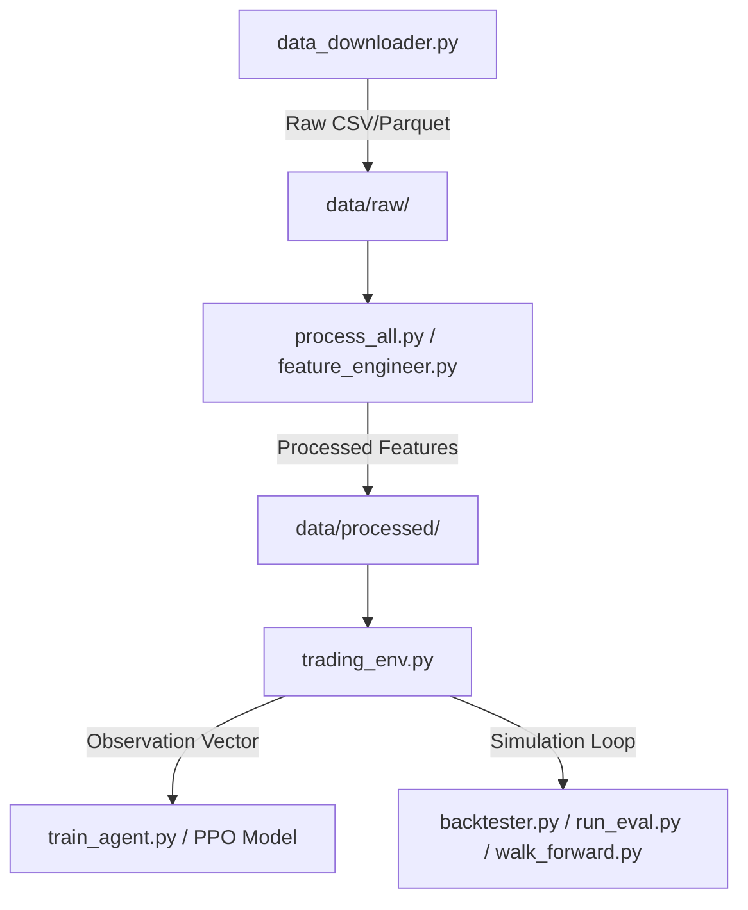

# System Architecture

This document describes the overall software architecture and data pipeline of the Reinforcement Learning trading framework.

---

## 1. Modular Design Overview

The framework is divided into modular components, each with a single responsibility:

### Components
1. **Data Downloader** ([data_downloader.py](file:///mnt/c/Users/Saket/Desktop/Projects/Finsearch_RL/src/utils/data_downloader.py)): Downloads raw daily financial data from Yahoo Finance and validates it.
2. **Feature Engineering** ([feature_engineer.py](file:///mnt/c/Users/Saket/Desktop/Projects/Finsearch_RL/src/features/feature_engineer.py)): Calculates and normalizes price, trend, momentum, volatility, and volume indicators.
3. **Trading Environment** ([trading_env.py](file:///mnt/c/Users/Saket/Desktop/Projects/Finsearch_RL/src/environment/trading_env.py)): Subclasses `gymnasium.Env` to simulate single-asset trading, portfolio revaluation, transaction fees, and slippage.
4. **Baselines** ([baseline_strategies.py](file:///mnt/c/Users/Saket/Desktop/Projects/Finsearch_RL/src/baselines/baseline_strategies.py)): Rule-based trading strategies (Buy & Hold, EMA, RSI, Random) that establish benchmarks.
5. **Agent Training** ([train_agent.py](file:///mnt/c/Users/Saket/Desktop/Projects/Finsearch_RL/src/training/train_agent.py)): Trains Stable-Baselines3 PPO models.
6. **Backtesting & Evaluation** ([backtester.py](file:///mnt/c/Users/Saket/Desktop/Projects/Finsearch_RL/src/evaluation/backtester.py)): deterministic rollout evaluations, metrics calculation, and plotting.
7. **Walk-Forward Validation** ([walk_forward.py](file:///mnt/c/Users/Saket/Desktop/Projects/Finsearch_RL/src/evaluation/walk_forward.py)): Rolling time-series cross-validation.

---

## 2. Information Flow during Agent Stepping

At step $t$:
1. The **Trading Environment** reads row $t$ of the processed stock data.
2. It concatenates the stock features with the normalized **Portfolio State** (cash ratio, position ratio, cumulative return) to form a 19-dimensional observation vector.
3. The **PPO Agent** (policy network) reads this observation vector and predicts a discrete action $a_t \in \{0, 1, 2\}$ (Hold, Buy, Sell).
4. The environment executes the action:
   - Deducts transaction fees (0.1%) and applies price slippage (0.05%).
   - Moves to step $t+1$.
   - Revalues the portfolio using the Close price at step $t+1$.
5. The environment computes the reward $R_t$ and returns $(obs_{t+1}, R_t, terminated_t, truncated_t, info_t)$ to the training loop.
